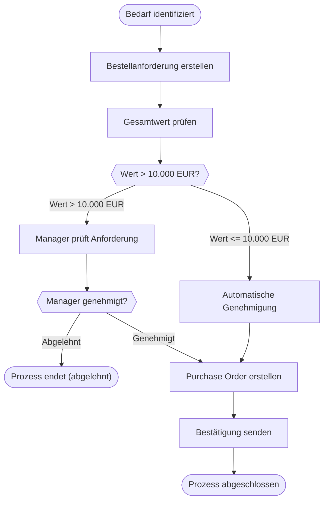

# Process Documentation: unknown

## 1. Process Diagram
Here is the visual representation of the process:

## 2. Metadata
- **Source:** unknown (Original: unknown)
- **Workflow ID:** unknown
- **Generated at:** 20251121_182004

---
*Generated by Process Diagram Multi-Agent System*
